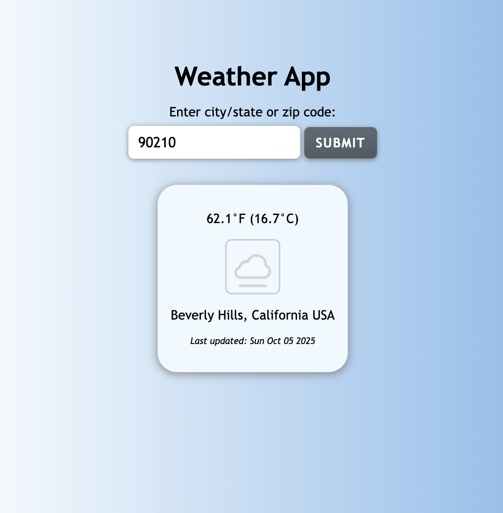

# Simple Weather API

> View the current weather by entering your desired location.

> 

## Table of Contents

1. [Tech Stack](#tech-stack)
1. [Development](#development)
   1. [Weather API](#weather-api)
   1. [Notes](#notes)

## Tech Stack

- **HTML**
- **CSS**
- **JavaScript**

## Development

### Weather API

- Obtain a free API key from: https://www.weatherapi.com/
- Update the `WEATHER_API_KEY` value with your key on line 1 of main.js.
- Open the app in your browser, and enter a city and state or zip code and view the current weather!

### Notes

View the official documentation at https://www.weatherapi.com/docs/ for more information on API use, copyright, and rate limitations.
